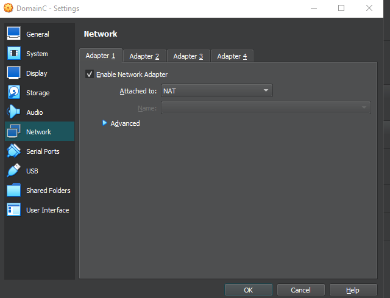
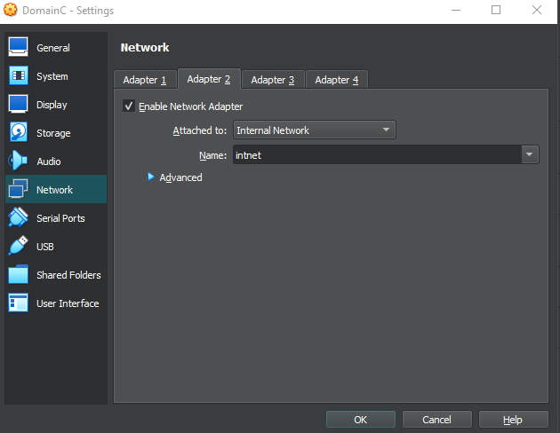
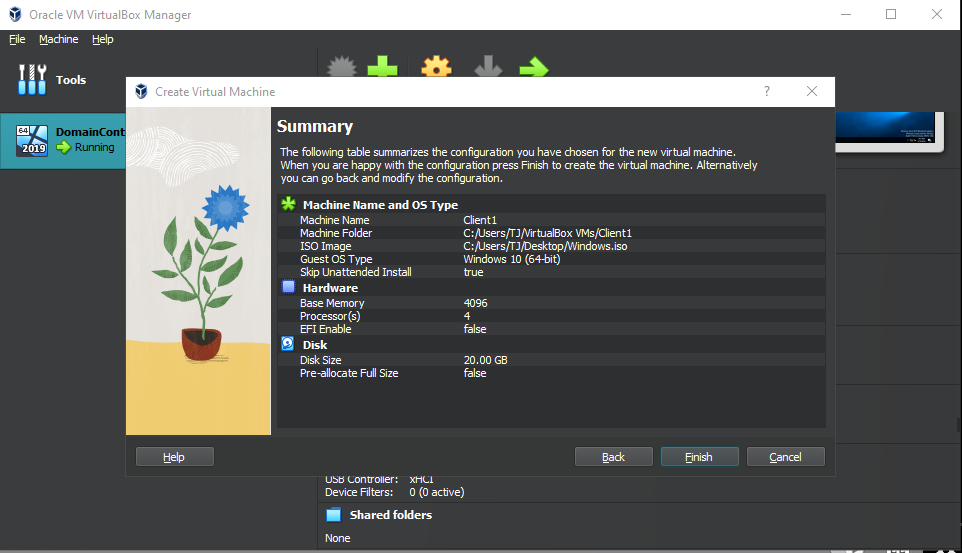
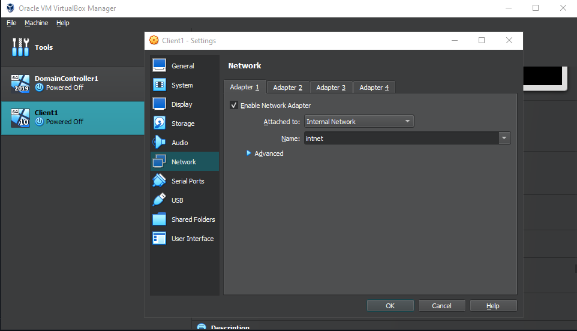
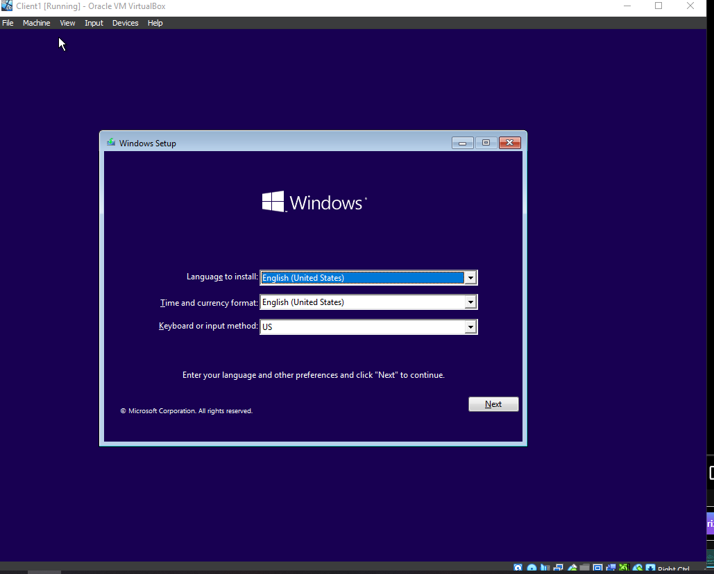
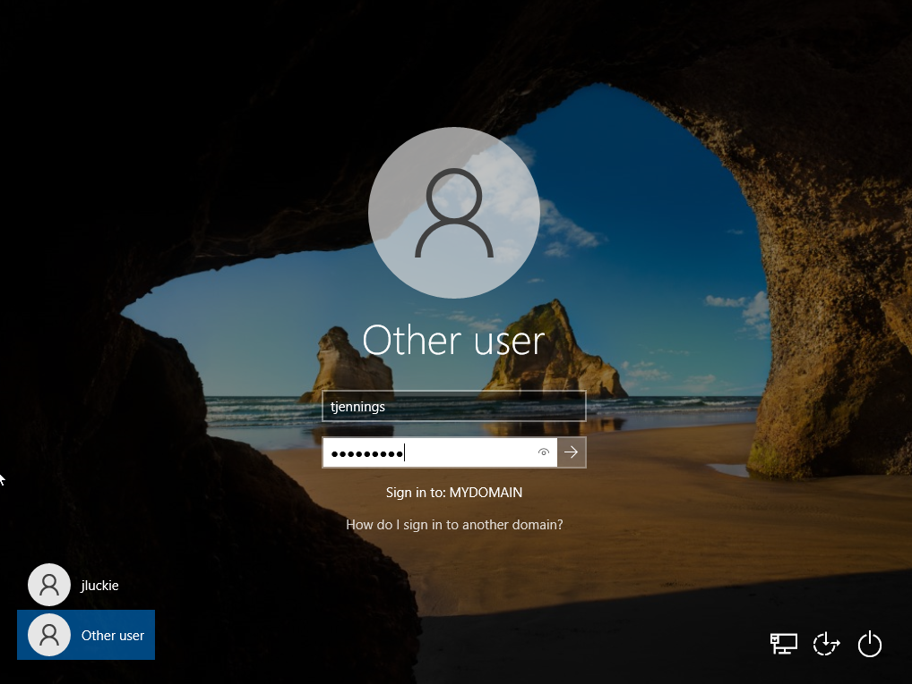
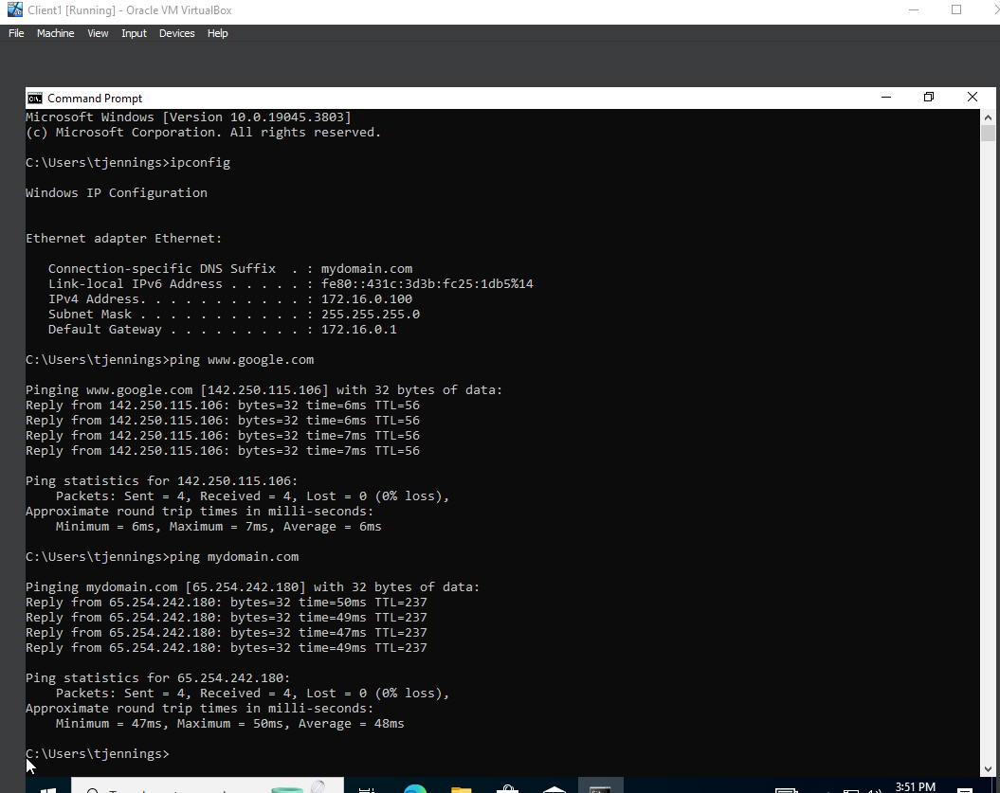
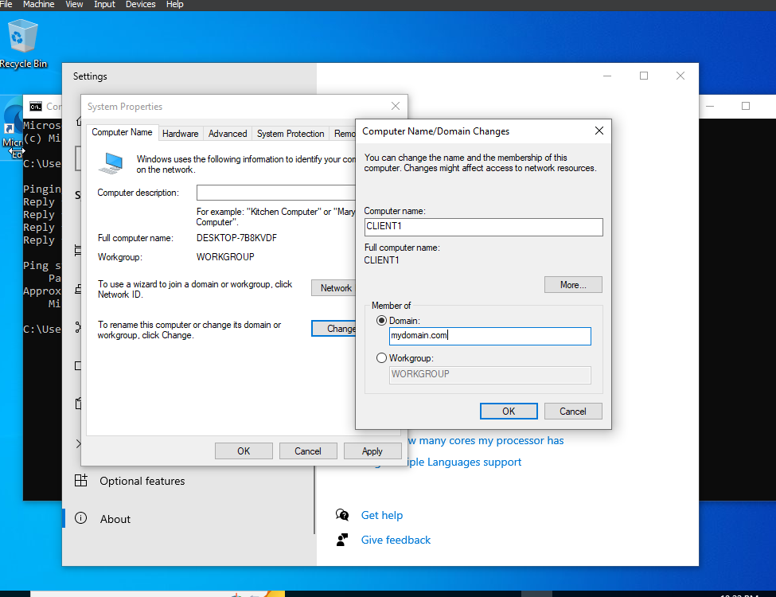
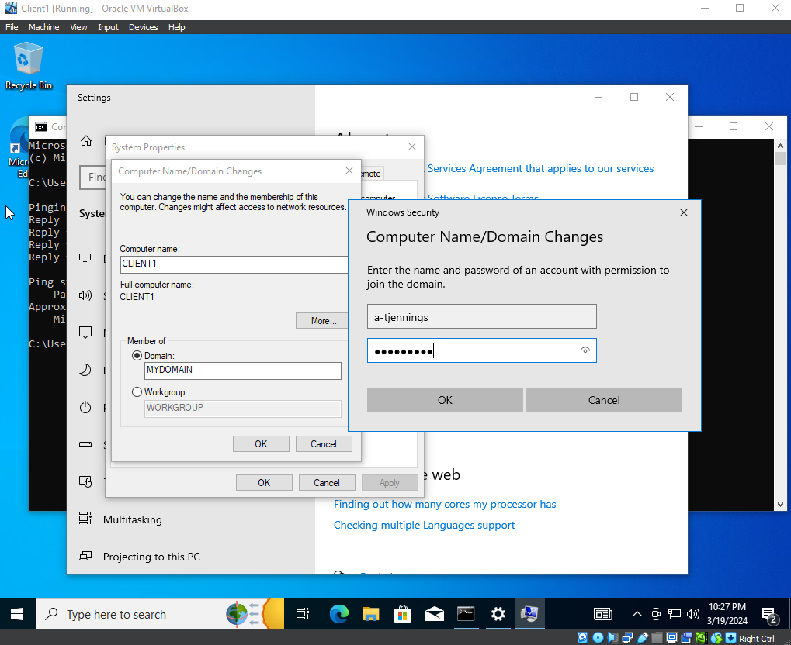
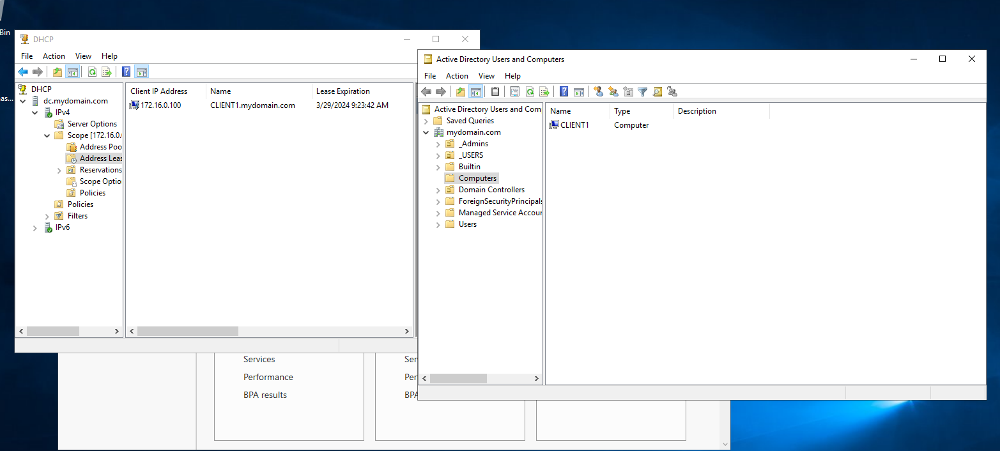

<h1>Active Directory Lab</h1>


<h2>Description</h2>
This project consist of me setting a basic home lab running Active Directory with Oracle VirtualBox and adding users with PowerShell. <br />
In this lab I will get experience using Active directory, PowerShell, Windows Server, and Virtualization (VirtualBox).

<br />


<h2>Languages and Utilities Used</h2>

- <b>PowerShell</b> 
- <b>Oracle VirutalBox</b>
- <b>Windows 10 ISO</b>
- <b>Windows Server 2019</b>


<h2>Environments Used </h2>

- <b>Windows 10</b> (21H2)

<h2>Lab walk-through:</h2>

<p align="center">
<b>Setup virtual box and Windows Sever 2019:</b> <br/>



</p>
- First was to create domain controller. So I needed my VM to have two NICs, one for the internet and another for the internal network to emulate some sort of corporate enviorment
<br />
<br />
<p align="center">
</b>Run the VM and install the Windows server 2019 ISO:</b>  <br/>


<br />
<br />
</b>Give default administrator account a password and login:</b> <br/>

</p>
<br />
<br />
<p align="center">
</b>Setup Ipv4 Addressing for the internal network:</b>  <br/>

</p>
- Here I assign an ip address to the internal NIC <br />
- The domain controller will serve as the default gateway so its empty <br />
- The server itself will act as a DNS server because active directory will install DNS
<br />
<br />
<p align="center">
</b>Install Active directory Domain services and create domain:</b>  <br/>


</p>
- Here I installed Active directory by clicking add role in server manager and checking the box named Active Directory Domain service
<br />
<br />
<p align="center">
</b>Process takes time to complete:</b>  <br/>

<br />
<br />
</b>Post deployment configuration promote server:</b>  <br/>


</p>
- After Active Directory is installed post deployment configuration needs to be done to promote the server to the domain controller <br />
<br />
<br />
<p align="center">
</b>Create an Organzational Unit in Active directory users and computers:</b>  <br/>

<br />
<br />
</b>Created new user in admin folder:</b>  <br/>


<br />
<br />
</b>Make created user a domain admin:</b>  <br/>

 
<br />
<br />
</b>Sign in to new created admin account:</b>  <br/>

<br />
<br />
</b>Install and configure RAS/NAT for client computers:</b>  <br/>


<br />
- Installing this feature will allow our internal clients access to the internet through the domain controller
<br />
<br />
</b>Install DHCP server on DC:</b>  <br/>

<br />
<br />
</b>Configure new DHCP scope:</b>  <br/>


<br />
<br />
</b>Downloaded a custom PowerShell script that generates names and creates user accounts:</b>  <br/>
[download script file here](https://github.com/joshmadakor1/AD_PS)
<br />
<br />
</b>Added a user to the generate name text file:</b>  <br/>

<br />
<br />
</b>Run PowerShell script:</b>  <br/>


<br />
<br />
</b>Open AD users and computers to check creation of users:</b>  <br/>


<br />
<br />
</b>Create new client VM change network settings to internal network:</b>  <br/>
 


<br />
<br />
</b>Sign in to client using newly created user from Active Directory:</b>  <br/>

<br />
<br />
<p align="center">
</b>Check client network details:</b>  <br/>

</p>
<br />
- I opened the command prompt on the client machine and used the ip config command to inspect network details <br />
- Used the ping command to check if the DNS server is working and to get an echo reply <br />
- This means are client computer has connectivity to the default gateway which is the domain controller <br />
- The domain controller is properly fowarding that connection out to the internet and back
<br />
<br />
<p align="center">
</b>Rename client PC and join domain:</b>  <br/>


</p>
- Here I used the created user credentials to join this client to the domain
<br />
<br />
<p align="center">
</b>Client1 VM shown in Active Directory:</b>  <br/>

</p>
-The client VM is now apart of the domain.
<br />
<br />
<p align="center">
-This completes my Active Directory lab. I hoped you enjoyed.
<br />
<br />

<br />


<!--
 ```diff
- text in red
+ text in green
! text in orange
# text in gray
@@ text in purple (and bold)@@
```
--!>
